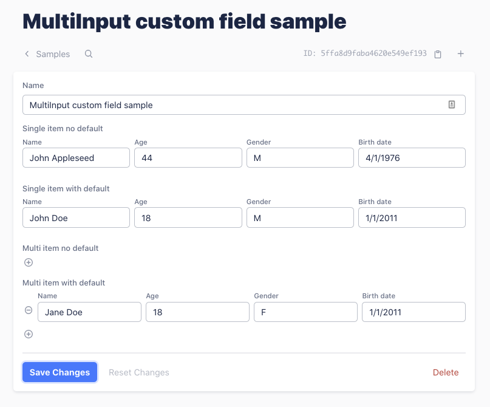

# keystone-multi-input-field



Allow one Keystone field to hold multiple values. The underlying field is a Text field. 

The values are stringified into a JSON before saving, and deserialized before displaying.

If `defaultValue` is provided, it must have the same number of elements as `options`.

## Example

```javascript
const MultiInput = require("@savvystack/keystone-multi-input-field");

keystone.createList("Sample", {
  fields: {
    ...
    singleNoDefault: { type: MultiInput, options: ["name", "age", "sex", "birthDate"] },
    singleWithDefault: { type: MultiInput, options: ["name", "age", "sex", "birthDate"], defaultValue: ["default", 18, "M", "1/1/2011"] },
    multiNoDefault: { type: MultiInput, options: ["name", "age", "sex", "birthDate"], multi: true },
    multiWithDefault: { type: MultiInput, options: ["name", "age", "sex", "birthDate"], multi: true, defaultValue: ["default", 18, "M", "1/1/2011"] },
    ...
  }
});

```

## Credit
Based on the `MultiCheck` custom field sample in [KeystoneJS](https://www.keystonejs.com).