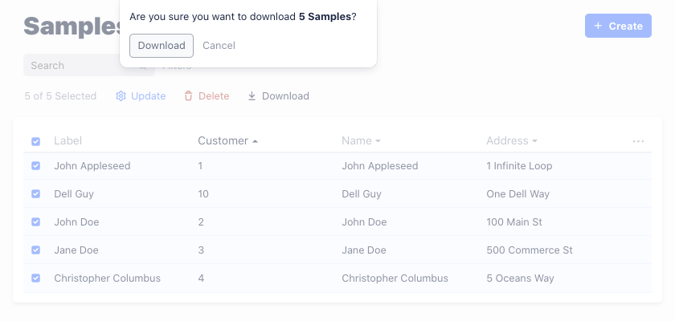

# CSV Download

A custom action that downloads the currently selected items as CSV:




## Usage

The `Download` button is added to so-called *list manage actions*, through Admin UI hooks.

```javascript
module.exports = {
  keystone,
  apps: [
    new GraphQLApp(),
    new AdminUIApp({
      name: process.env.PROJECT_NAME || "Keystone",
      enableDefaultRoute: true,
      authStrategy,
      hooks: require.resolve("../keystone-addons/src/actions/"),
    }),
  ],
  authStrategy,
};
```

Please keep in mind that:
1. `keystone-addons` needs to be installed as a git submodule. There isn't an NPM package at the moment;
2. Depending on your directory structure, and where you cloned `keystone-addons`, you might need to change
the path on the line with `hooks`.

## Limitations

Only the items being displayed on the current page can be downloaded. In the case of a large list 
with pagination, the user will have to download it into multiple CSV files. Alternatively, the user
can choose to view all items on the same page, by tweaking `pageSize` on the URL (not very friendly
with end users, I know).

Only CSV format is supported at the moment.

## Known issues

None.