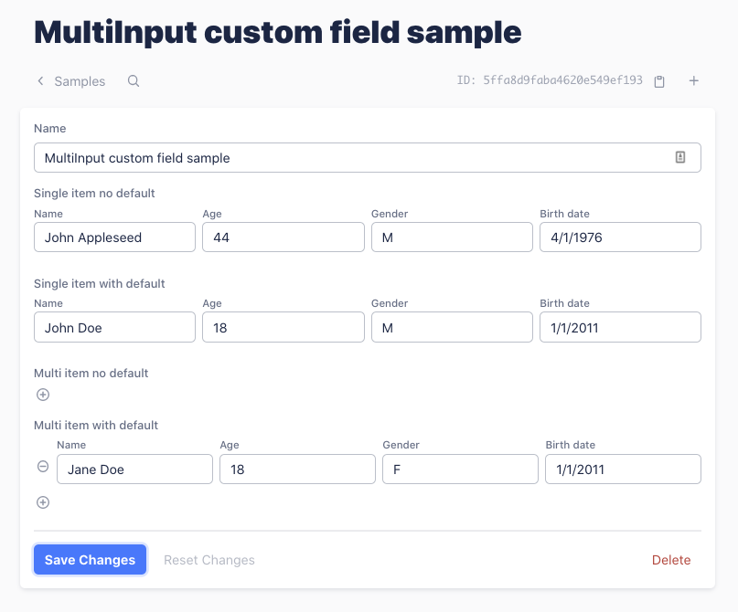

# MultiInput field



Allow one Keystone field to hold multiple values. The underlying field is a Text field. 

The values are stringified into a JSON before saving, and deserialized before displaying.

If `defaultValue` is provided, it must have the same number of elements as `options`.


## Props

| Name | Type | Required | Description |
| --- | --- | --- | --- |
| `options`       | Array of strings | No* | Each option will create a subfield. The option string will be *decamelized* and used as the field label. It's also used as the key in the serialized JSON data. |
| `subfields`     | Array of objects | No* | Either `options` or `subfields` must be provided. Supported properties on each subfield: label, groupLabel. |
| `repeatable`    | Boolean | No | If set to true, the field can hold multiple items, each having the same subfields. Default is false. | 
| `defaultValue`  | Array of primitives | No | Provide default values to each subfield. |


## Example

```javascript
const MultiInput = require("./keystone-addons/src/fields/MultiInput");

keystone.createList("Sample", {
  fields: {
    ...
    singleNoDefault: { type: MultiInput, options: ["name", "age", "sex", "birthDate"] },
    singleWithDefault: { type: MultiInput, options: ["name", "age", "sex", "birthDate"], defaultValue: ["default", 18, "M", "1/1/2011"] },
    multiNoDefault: { type: MultiInput, options: ["name", "age", "sex", "birthDate"], repeatable: true },
    multiWithDefault: { type: MultiInput, options: ["name", "age", "sex", "birthDate"], repeatable: true, defaultValue: ["default", 18, "M", "1/1/2011"] },
    withSubfields: { type: MultiInput, subfields: { 
      firstName: { label: "First Name", groupLabel: "Full Name" },
      lasttName: { label: "Last Name" },
      street: { label: "Number and Street", groupLabel: "Address" },
      city: { label: "City or Town" },
      state: { label: "State or Province" },
      postalCode: { label: "Postal Code" },
    }
    ...
  }
});

```

## Known issues

1. "Reset Changes" is not working at the moment.
