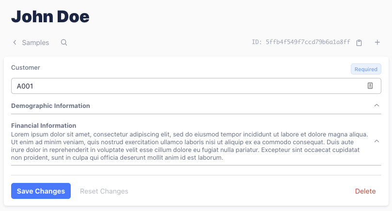

# Section field

Collapsible Section header:




`Section` is based on the built-in `Virtual` field type. They won't show up in the database schema. However, you'll find them in the GraphQL schema, which you can safely ignore.

## Props

| Name | Type | Required | Description |
| --- | --- |
| `collapsible` | Boolean | No | Whether this section is collapsible. |


## Example

```javascript
const Section = require("./keystone-addons/src/fields/Section");

keystone.createList("Sample", {
  fields: {
    customerId: { type: Text, isRequired: true },
    section1: {
      label: "Demographic Information",
      type: Section,
    },
    name: { type: Text },
    address: { type: Text },
    section2: {
      type: Section,
      label: "Financial Information",
      adminDoc:
        "Lorem ipsum dolor sit amet, consectetur adipiscing elit, sed do eiusmod tempor incididunt ut labore et dolore magna aliqua. Ut enim ad minim veniam, quis nostrud exercitation ullamco laboris nisi ut aliquip ex ea commodo consequat. Duis aute irure dolor in reprehenderit in voluptate velit esse cillum dolore eu fugiat nulla pariatur. Excepteur sint occaecat cupidatat non proident, sunt in culpa qui officia deserunt mollit anim id est laborum.",
    },
    checkingAccount: { type: Text, isRequired: true },
    savingAccount: { type: Text },
    creditCard: { type: Text },
    ...
  }
});

```

## Known issues

None.